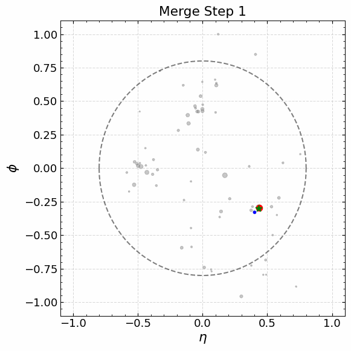

# Anti-kT GIFs

## Description

The following GIFs illustrate the step-by-step jet reconstruction process of the anti-kT algorithm.
In each frame, the red and blue particles are merged into a new pseudo-particle, shown as a green star.
The area of each particle is proportional to the logarithm of its transverse momentum.
The jet radius parameter R=0.8 is indicated by the dashed, semi-transparent black circle.

## QCD Outlier

## Semi-Visible Outlier

